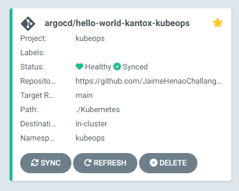
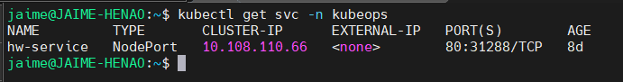
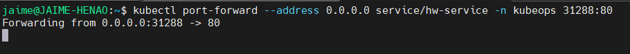
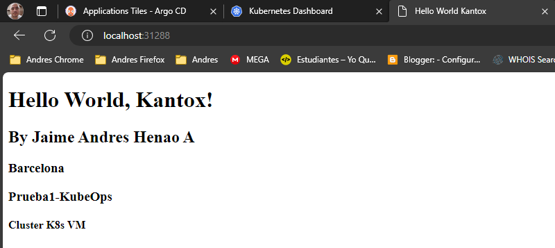

# Proyecto Hello World con Kubernetes, GitHub Actions y ArgoCD por Jaime Andres Henao


## Estructura del Proyecto:

```console
├── KubeOps
│   ├── .github
│   │   └── workflows
│   │       └── cd.yml
│   ├── Docker
│   │   ├── Dockerfile
│   │   ├── index.html
│   ├── Kubernetes
│   │   ├── deployment.yaml
│   │   ├── service.yaml
│   ├── .gitignore
│   └── README.md
└──
```

Este proyecto demuestra cómo desplegar una aplicación "Hello World" en un clúster de Minikube utilizando GitHub Actions para la implementación continua y ArgoCD para la entrega continua.

## Contexto.

En este proyecto, he implementado un entorno de desarrollo en WSL2 de Ubuntu 22.04 en Windows, desplegando un clúster Minikube. Utilicé Helm para instalar ArgoCD y configuré un repositorio en GitHub como fuente única de verdad para la aplicación "Hola mundo". El objetivo principal es demostrar maestría en GitOps y Kubernetes a través de GitHub Actions y ArgoCD.

* Estructura del Proyecto

1. Configuración del Entorno:

    Instalé Minikube en WSL2 y lo inicialicé para crear un clúster Kubernetes local.
    Utilicé Helm para instalar ArgoCD en el clúster.

2. Repositorio en GitHub:

    Creé un repositorio en GitHub que actúa como fuente única de verdad para la aplicación.
    El repositorio contiene el archivo cd.yml que define el pipeline de GitHub Actions.

3. Estructura de Carpetas:

    Docker: Contiene el Dockerfile y el archivo index.html para construir la imagen de "Hola mundo".
    Kubernetes: Contiene los manifiestos deployment.yaml y service.yaml para el despliegue en Kubernetes.
    GitHub Actions Pipeline (cd.yml)

    Paso 1 - Construcción de la Imagen:

        Se crea una imagen de Docker para la aplicación utilizando el Dockerfile.
        La imagen se etiqueta con un identificador único (SHA) y se empuja al repositorio de DockerHub.

    Paso 2 - Actualización del Pipeline y GitOps:

        Se actualiza el archivo cd.yml con el nuevo SHA.
        Se realiza un commit y un push al repositorio de GitHub.

    Paso 3 - Despliegue Automático con ArgoCD (GitOps):

        ArgoCD, configurado con Helm, detecta automáticamente el cambio en el repositorio de GitHub.
        Aplica los manifiestos de Kubernetes almacenados en el repositorio para realizar el despliegue.

* Resultados Esperados:

    1. GitOps:

        La aplicación "Hola mundo" se despliega y actualiza automáticamente en el clúster Minikube.
        ArgoCD gestiona el estado deseado del clúster basándose en el repositorio de GitHub.

    2. GitHub Actions:

        El pipeline se ejecuta con éxito cada vez que se realiza un cambio en el repositorio.
        La imagen se construye, etiqueta y empuja a DockerHub, y se actualiza el archivo cd.yml.

3. Consideraciones Adicionales:

        La estructura del proyecto y el pipeline están diseñados para lograr despliegues sin tiempo de inactividad.
        Se ha implementado una estrategia de versionado y seguimiento mediante el uso de SHAs para garantizar consistencia.
        La integración entre GitHub Actions, DockerHub y ArgoCD permite un flujo de desarrollo y despliegue continuo.
        ¡Este proyecto demuestra mi capacidad para abordar el Desafío KubeOps, destacando mis habilidades en Kubernetes, GitOps, y herramientas como GitHub Actions y ArgoCD!

## Guia de ArgoCD en Kubernetes (minikube) con GitHub Actions

Instalación con Helm Chart y gestion desde CLI

**Requisitos previos:**

* Instalamos el binario de Helm https://helm.sh/docs/intro/install/

* Instalamos Minikube https://minikube.sigs.k8s.io/docs/start/

* Instalamos el Binario de ArgoCD https://argo-cd.readthedocs.io/en/stable/cli_installation/

**Guia**

1.	Iniciamos nuestro Minikube para contar con un Clúster de K8s en local

    minikube start

2.	Añadimos el repo de Helm

    helm repo add argo https://argoproj.github.io/argo-helm

3.	Hacemos pull del Chart para descargarlo, poder ver el contenido del Chart e instalarlo.

    helm pull argo/argo-cd --version 5.8.2

4.	Descomprimimos el paquete TGZ del Chart descargado

    tar -zxvf argo-cd-5.8.2.tgz

5.	Hacemos la instalación pasando parámetros de configuración

    helm install argo-cd argo-cd/ \
    --namespace argocd \
    --create-namespace --wait \
    --set configs.credentialTemplates.github.url=https://github.com/JaimeHenaoChallange/KubeOps.git \
    --set configs.credentialTemplates.github.username=$(cat ~/.secrets/github/JaimeHenaoChallange/user) \
    --set configs.credentialTemplates.github.password=$(cat ~/.secrets/github/JaimeHenaoChallange/token)


6.	Imprimimos en pantalla la contraseña del usuario "admin" por defecto que se ha generado automáticamente en la instalación

    kubectl -n argocd get secret argocd-initial-admin-secret -o jsonpath="{.data.password}" | base64 -d; echo

7.	Levantamos un Port-Forward para poder acceder a ArgoCD UI desde localhost:8080

    kubectl port-forward --address 0.0.0.0 service/argo-cd-argocd-server -n argocd 8080:443

8.	Hacemos login en ArgoCD con la contraseña que hemos obtenido

    argocd login localhost:8080

9.	Una vez que hemos hecho login satisfactoriamente cambiamos la contraseña generada por una que nos venga mejor, como por ejemplo "passwd1234"

    argocd account update-password

10.	Ahora que estamos logados con el binario de argocd podemos agregar el repositorio de código.

    argocd repo add https://github.com/JaimeHenaoChallange/KubeOps.git


11.	Creamos un proyecto de pruebas para kantox en el que solo se puedan crear aplicaciones en el namespace "kantox" y con determinado repositorio de código

    argocd proj create kubeops -d https://kubernetes.default.svc,kubeops -s https://github.com/JaimeHenaoChallange/KubeOps.git

12.	Creamos el Namespace "kantox" que será el que usaremos para desplegar las aplicaciones

    kubectl create ns kubeops

13.	Ahora creamos nuestra primera aplicación de pruebas en el proyecto que hemos creado anteriormente

    argocd app create hello-world-kantox-kubeops \
    --repo https://github.com/JaimeHenaoChallange/KubeOps.git \
    --revision main --path ./Kubernetes  \
    --dest-server https://kubernetes.default.svc \
    --dest-namespace kubeops \
    --sync-policy automated \
    --project kubeops


14.	Esperamos que sincronice la app de argocd:

    

15.	Verificamos el svc de la app creada para ver le puerto (kubectl get svc -n kubeops):

    

16.	Realizamos un port-forward para verificar que la app se ve bien:

    

    

**Diagrama**


Jaime A. Henao
Cloud Enginer.